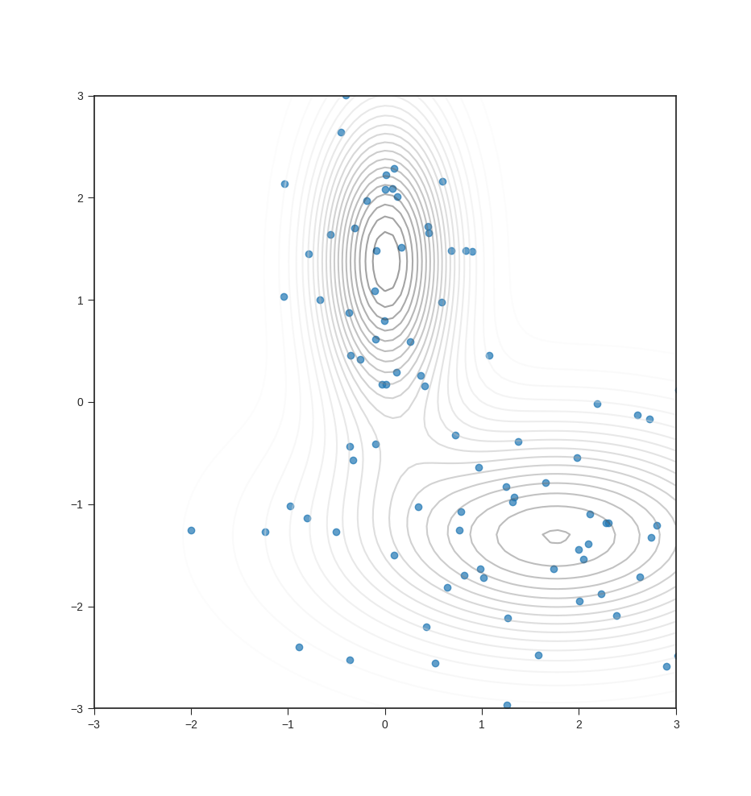

# `svgd`

Implementation of Stein Variational Gradient Descent:

```
@misc{liu2019stein,
  title = {Stein Variational Gradient Descent: A General Purpose Bayesian Inference Algorithm},
  author = {Qiang Liu and Dilin Wang},
  year = {2019},
  eprint = {1608.04471},
  archivePrefix = {arXiv},
  primaryClass = {stat.ML},
}
```

## Example

To visualize the dynamics of the particles, you can run

```bash
$ PYTHONPATH=. python svgd/examples/testbed.py
```

Below is an example snapshot of the particles after they've converged.


